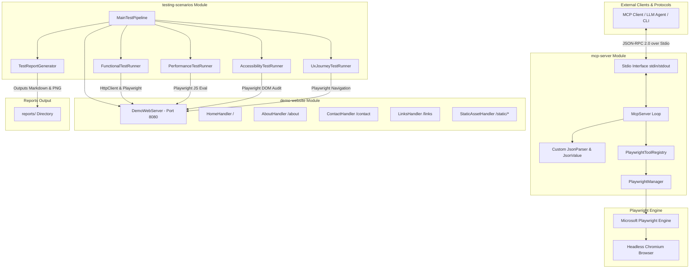
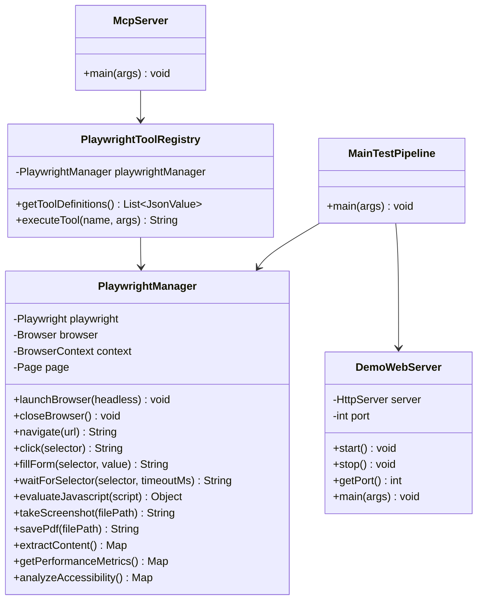
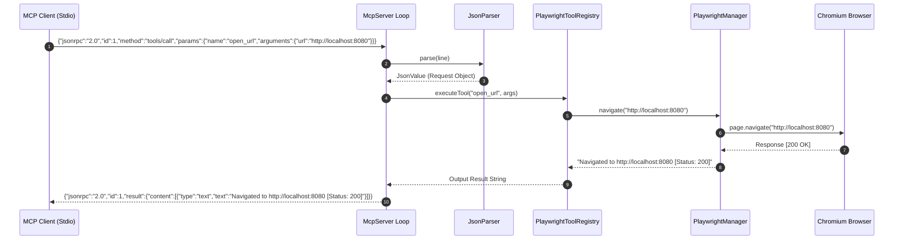
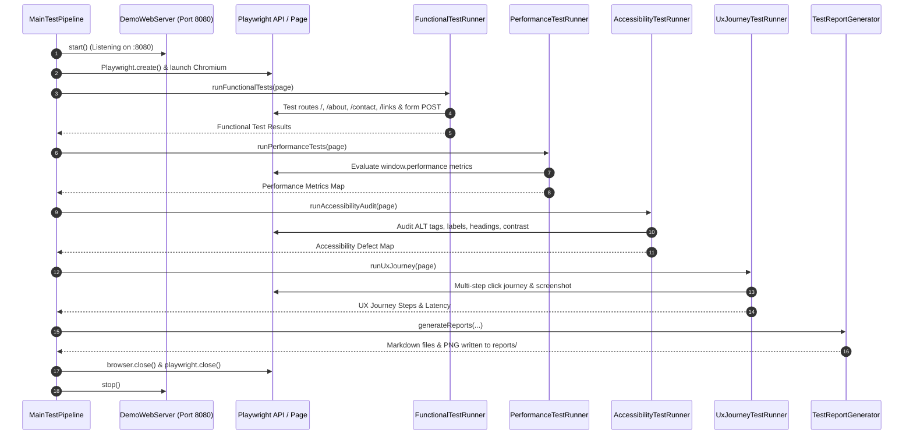

# Project Architecture & Systems Design

This document details the system design, component architecture, module relationships, interaction sequences, and process isolation model for the **Java Playwright MCP Demonstration & Automated Testing Suite**.

---

## 🏛️ System Architecture Overview

The system is designed as a multi-module Java 21 repository consisting of three decoupled core components:

1. **`demo-website`**: A standalone HTTP web server serving a retro late-1990s website using JDK's built-in `com.sun.net.httpserver.HttpServer`.
2. **`mcp-server`**: A Model Context Protocol (MCP) server communicating over Standard Input/Output (`stdio`) using JSON-RPC 2.0. It bridges MCP clients (e.g. LLM agents) to a headless Chromium browser powered by Microsoft Playwright Java.
3. **`testing-scenarios`**: An automated end-to-end test execution pipeline that orchestrates the `demo-website` and `mcp-server` / Playwright API to run functional, performance, accessibility, and multi-step UX journey audits.



---

## 📦 Component Relationships & Module Boundaries



---

## 🔄 Interaction Sequence Diagrams

### 1. MCP Tool Call Sequence (Stdio Mode)

The following diagram illustrates how an external MCP client (or LLM agent) invokes a browser automation tool (`open_url`) via Standard Input/Output:



### 2. Automated Test Suite Pipeline Sequence

The following diagram details the sequence executed when running `MainTestPipeline`:



---

## 🖥️ Runtime & Deployment Isolation Model

```mermaid
graph LR
    subgraph Host OS Environment (Linux / macOS / Windows)
        JVM[Java 21 Virtual Machine]
        
        subgraph Process 1: Demo Web Server
            HttpServer[com.sun.net.httpserver.HttpServer :8080]
            Executors[Virtual Thread Per Task Executor]
            HttpServer --- Executors
        end
        
        subgraph Process 2: MCP Server / Test Execution
            McpLoop[McpServer Stdio Reader Loop]
            PWDriver[Playwright Java Driver Node Subprocess]
            Chromium[Chromium Headless Process]
            
            McpLoop --> PWDriver
            PWDriver --> Chromium
        end
        
        JVM --> Process 1
        JVM --> Process 2
    end
```

---

## 🔬 Architectural Key Decisions & Trade-offs

1. **Zero-Dependency JSON Parsing (`mcp-server`):**
   - **Decision:** Implemented a minimal custom recursive-descent parser (`JsonParser`, `JsonValue`).
   - **Rationale:** Avoids heavy third-party JSON dependencies (like Jackson or Gson), making the `mcp-server` lightweight, self-contained, and fast to initialize.
2. **JDK Native HTTP Server (`demo-website`):**
   - **Decision:** Used `com.sun.net.httpserver.HttpServer` with Java 21 `Executors.newVirtualThreadPerTaskExecutor()`.
   - **Rationale:** Eliminates external framework overhead (Spring Boot, Micronaut, Netty) while utilizing modern virtual threads for high concurrency and clean lifecycle management.
3. **Synchronous Stdio Loop (`mcp-server`):**
   - **Decision:** Read `System.in` line by line and output JSON-RPC 2.0 messages directly to `System.out`.
   - **Rationale:** Strictly conforms to the standard Model Context Protocol Stdio transport specification.
