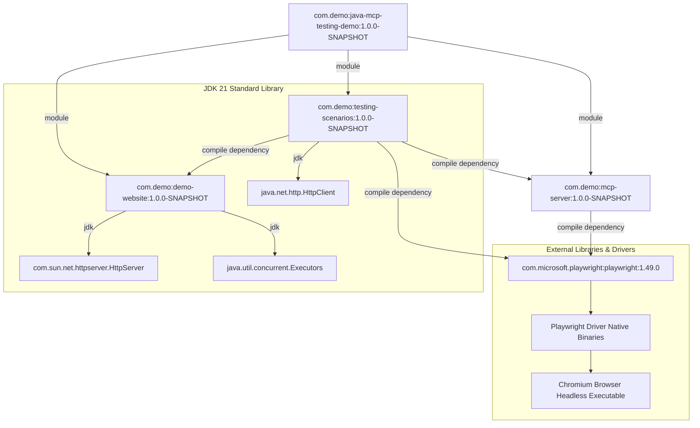
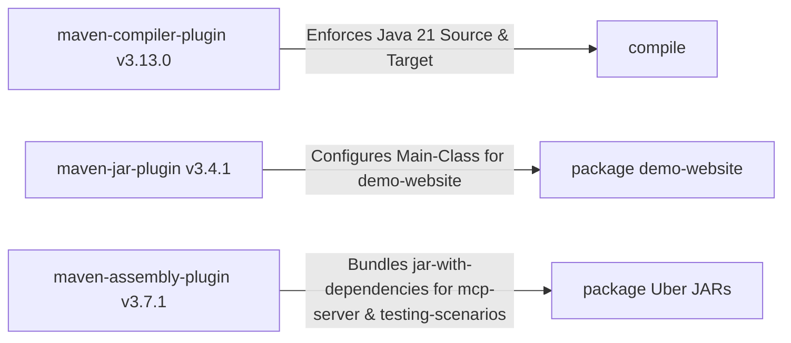

# Dependency Graph & Package Management

This document details the internal module dependencies, external library requirements, transitive dependencies, and build plugins for the Java Playwright MCP Demonstration project.

---

## 📦 Project Dependency Architecture

The project uses **Apache Maven** for project lifecycle management, compilation, dependency resolution, and executable JAR packaging.

---

## 📋 Dependency Specification Table

| Artifact / Module | Scope | Version | License / Provider | Purpose |
|-------------------|-------|---------|--------------------|---------|
| `com.demo:java-mcp-testing-demo` | Parent POM | `1.0.0-SNAPSHOT` | Local Project | Defines multi-module structure, target Java version (`21`), and property `${playwright.version}` (`1.49.0`). |
| `com.demo:demo-website` | Module | `1.0.0-SNAPSHOT` | Local Project | Retro HTTP web server. Uses zero third-party Java libraries. |
| `com.demo:mcp-server` | Module | `1.0.0-SNAPSHOT` | Local Project | Playwright MCP server over Stdio. Packaging: Assembly `jar-with-dependencies`. |
| `com.demo:testing-scenarios` | Module | `1.0.0-SNAPSHOT` | Local Project | Test execution pipeline. Depends on `demo-website` and `mcp-server`. |
| `com.microsoft.playwright:playwright` | Compile | `1.49.0` | Apache-2.0 (Microsoft) | Headless browser automation engine for Chromium, WebKit, and Firefox. |

---

## 🛠️ Build System & Maven Plugins

The parent and module POM files configure the following Maven plugins:

1. **`org.apache.maven.plugins:maven-compiler-plugin:3.13.0`**
   * Configured in parent POM (`pom.xml`).
   * Source level: `21`
   * Target level: `21`
   * Encoding: `UTF-8`

2. **`org.apache.maven.plugins:maven-jar-plugin:3.4.1`**
   * Configured in `demo-website/pom.xml`.
   * Sets `Main-Class` manifest header to `com.demo.website.DemoWebServer`.

3. **`org.apache.maven.plugins:maven-assembly-plugin:3.7.1`**
   * Configured in `mcp-server/pom.xml` and `testing-scenarios/pom.xml`.
   * Uses descriptor `jar-with-dependencies` to build self-contained executable fat JARs containing all compiled classes and transitive dependencies.
   * Execution target: `package` phase (`single` goal).
   * Main classes specified:
     * `mcp-server`: `com.demo.mcp.protocol.McpServer`
     * `testing-scenarios`: `com.demo.testing.MainTestPipeline`

---

## 🌐 External Runtime Dependencies

At runtime, Microsoft Playwright requires native driver binaries and browser executables:

1. **Playwright Java Driver:** Automatically downloads driver binaries for the host operating system (Linux x86_64/arm64, macOS, Windows) during initial execution.
2. **Chromium Browser Binaries:** Playwright launches its bundled Chromium browser executable in headless mode. No pre-installed system browser (Google Chrome or Chromium) is required.
