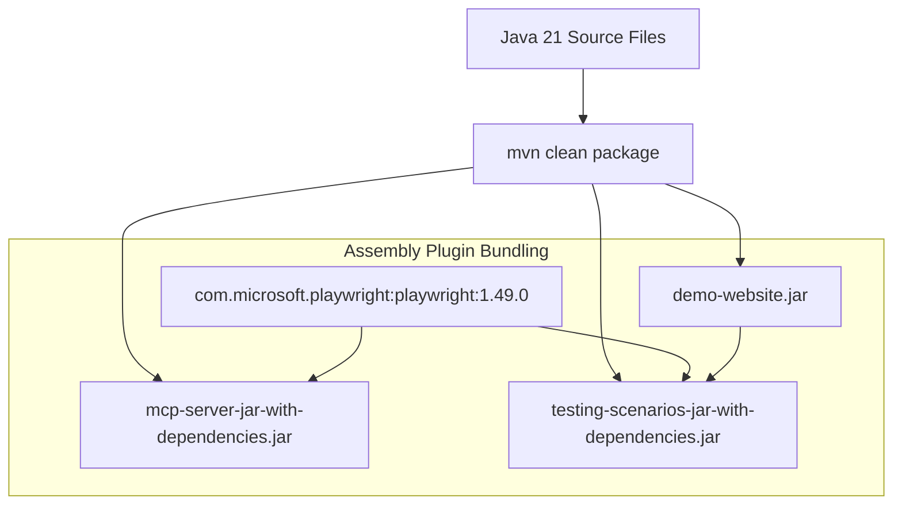

# Deployment Guide & Packaging Specification

This document details the production packaging, artifact assembly, deployment strategies, and process management for the components in this repository.

---

## 📦 Deployment Artifact Summary

| Component | Target Output Artifact | Packaging Type | Execution Target |
|-----------|------------------------|----------------|------------------|
| `demo-website` | `demo-website/target/demo-website-1.0.0-SNAPSHOT.jar` | Standard JAR | `java -jar demo-website.jar [port]` |
| `mcp-server` | `mcp-server/target/mcp-server-1.0.0-SNAPSHOT-jar-with-dependencies.jar` | Fat JAR (Uber JAR) | `java -jar mcp-server-...-jar-with-dependencies.jar` |
| `testing-scenarios` | `testing-scenarios/target/testing-scenarios-1.0.0-SNAPSHOT-jar-with-dependencies.jar` | Fat JAR (Uber JAR) | `java -jar testing-scenarios-...-jar-with-dependencies.jar` |

---

## 🏗️ Packaging Pipeline & Assembly



### Maven Assembly Plugin Execution

The `maven-assembly-plugin` (version `3.7.1`) is configured in `mcp-server/pom.xml` and `testing-scenarios/pom.xml`:

```xml
<plugin>
    <groupId>org.apache.maven.plugins</groupId>
    <artifactId>maven-assembly-plugin</artifactId>
    <version>3.7.1</version>
    <configuration>
        <descriptorRefs>
            <descriptorRef>jar-with-dependencies</descriptorRef>
        </descriptorRefs>
        <archive>
            <manifest>
                <mainClass>com.demo.mcp.protocol.McpServer</mainClass>
            </manifest>
        </archive>
    </configuration>
    <executions>
        <execution>
            <id>make-assembly</id>
            <phase>package</phase>
            <goals>
                <goal>single</goal>
            </goals>
        </execution>
    </executions>
</plugin>
```

---

## 🖥️ System Requirements & Environment

1. **Java Runtime Environment (JRE):** OpenJDK 21 Runtime Environment or higher.
2. **Memory:** Minimum 512 MB RAM for `demo-website`; 1 GB RAM for `mcp-server` / `testing-scenarios` (to accommodate Playwright Chromium process overhead).
3. **Permissions:**
   * Read access to local file system.
   * Write access to directory where `reports/` artifacts are created.
   * Network permission to bind local TCP port (`8080`).

---

## ⚙️ Integrating MCP Server into Client Agents

To configure an AI client (such as Claude Desktop, Gemini CLI, or custom MCP host agents) to run the `mcp-server` process automatically:

### Client Configuration Snippet (`claude_desktop_config.json` or `mcp_servers.json`)

```json
{
  "mcpServers": {
    "java-playwright-mcp": {
      "command": "java",
      "args": [
        "-jar",
        "/absolute/path/to/JiraMCP/mcp-server/target/mcp-server-1.0.0-SNAPSHOT-jar-with-dependencies.jar"
      ]
    }
  }
}
```

---

## 🛡️ Production & Security Considerations

1. **Process Isolation:** The MCP server communicates over Stdio. Ensure parent processes isolate environment variables and standard file handles appropriately.
2. **Headless Mode:** In headless server environments (CI/CD build nodes, Docker containers), Playwright operates without requiring an X11 window server display.
3. **Graceful Shutdown:** All processes implement clean shutdown hooks releasing TCP sockets (`server.stop(0)`) and browser instances (`browser.close()`).

---

## ☁️ Render Cloud Deployment & Render MCP Server Integration

This repository supports automated cloud deployment to [Render](https://render.com) using Infrastructure-as-Code via `render.yaml` and multi-stage containerization via `Dockerfile`. Furthermore, Render deployments and services can be managed and monitored using the Render Model Context Protocol (MCP) server integration (`@niyogi/render-mcp`).

### 1. Multi-Stage Docker Containerization (`Dockerfile`)

The application packaging for cloud hosting uses a multi-stage Docker build:

- **Stage 1 (Builder):** Based on `maven:3.9.6-eclipse-temurin-21-alpine`, copies project sources (`pom.xml`, `demo-website`, `mcp-server`, `testing-scenarios`), and builds all modules via `mvn clean package -DskipTests`.
- **Stage 2 (Runtime):** Based on `eclipse-temurin:21-jre-alpine`, copies only the compiled `demo-website.jar` artifact to `/app/demo-website.jar`.
- **Environment & Port:** Sets `ENV PORT=8080`, exposes port `8080`, and executes `java -jar demo-website.jar`.

### 2. Render Blueprint Infrastructure-as-Code (`render.yaml`)

The `render.yaml` specification defines the cloud service infrastructure:

```yaml
services:
  - type: web
    name: jira-mcp-demo-website
    env: docker
    plan: free
    healthCheckPath: /
    autoDeploy: true
    envVars:
      - key: PORT
        value: 8080
```

#### Deploying via Render Dashboard:
1. Log in to the Render Dashboard and click **New +** -> **Blueprint**.
2. Connect your GitHub repository (`VolodymyrUhera/java-mcp-testing-demo`).
3. Render automatically detects `render.yaml`, builds the Docker image, and launches the `jira-mcp-demo-website` web service.

### 3. Render MCP Server Integration (`@niyogi/render-mcp`)

The Render MCP server enables AI agents (such as Gemini CLI or Claude Desktop) to inspect, monitor, deploy, and manage your Render web services programmatically.

#### Setting Up `RENDER_API_KEY`
Obtain an API key from your Render account settings and set it in your environment:

```bash
export RENDER_API_KEY="rnd_your_render_api_key_here"
```

#### MCP Client Configuration (`.mcp.json`)
The project's root `.mcp.json` includes both the local `java-playwright-mcp` server and the `render` MCP server:

```json
{
  "mcpServers": {
    "java-playwright-mcp": {
      "command": "java",
      "args": [
        "-jar",
        "/home/voha/Documents/JiraMCP/mcp-server/target/mcp-server-1.0.0-SNAPSHOT-jar-with-dependencies.jar"
      ]
    },
    "render": {
      "command": "npx",
      "args": [
        "-y",
        "@niyogi/render-mcp",
        "start"
      ],
      "env": {
        "RENDER_API_KEY": "${RENDER_API_KEY}"
      }
    }
  }
}
```

#### Render MCP Tool Capabilities
When connected to an MCP client host, the Render MCP server provides tools to:
- **List & Query Services:** Retrieve active web services, job statuses, build records, and instance details.
- **Trigger Deploys:** Initiate automated manual deploys or clear build caches.
- **Log Streaming & Diagnostics:** Query real-time stdout/stderr service logs and deployment build outputs.
- **Service Management:** Update environment variables and service configurations.

