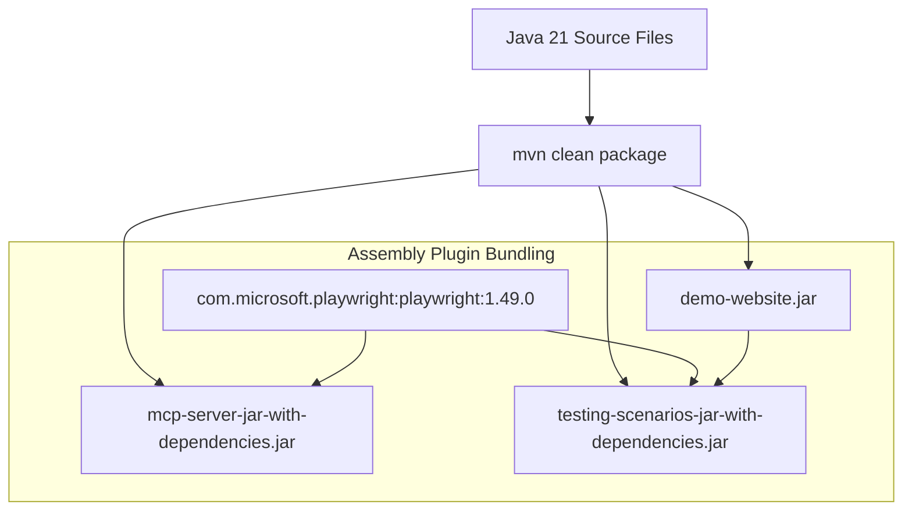

# Deployment Guide & Packaging Specification

This document details the production packaging, artifact assembly, deployment strategies, and process management for the components in this repository.

---

## 📦 Deployment Artifact Summary

| Component | Target Output Artifact | Packaging Type | Execution Target |
|-----------|------------------------|----------------|------------------|
| `demo-website` | `demo-website/target/demo-website-1.0.0-SNAPSHOT.jar` | Standard JAR | `java -jar demo-website.jar [port]` |
| `mcp-server` | `mcp-server/target/mcp-server-1.0.0-SNAPSHOT-jar-with-dependencies.jar` | Fat JAR (Uber JAR) | `java -jar mcp-server-...-jar-with-dependencies.jar` |
| `testing-scenarios` | `testing-scenarios/target/testing-scenarios-1.0.0-SNAPSHOT-jar-with-dependencies.jar` | Fat JAR (Uber JAR) | `java -jar testing-scenarios-...-jar-with-dependencies.jar` |

---

## 🏗️ Packaging Pipeline & Assembly



### Maven Assembly Plugin Execution

The `maven-assembly-plugin` (version `3.7.1`) is configured in `mcp-server/pom.xml` and `testing-scenarios/pom.xml`:

```xml
<plugin>
    <groupId>org.apache.maven.plugins</groupId>
    <artifactId>maven-assembly-plugin</artifactId>
    <version>3.7.1</version>
    <configuration>
        <descriptorRefs>
            <descriptorRef>jar-with-dependencies</descriptorRef>
        </descriptorRefs>
        <archive>
            <manifest>
                <mainClass>com.demo.mcp.protocol.McpServer</mainClass>
            </manifest>
        </archive>
    </configuration>
    <executions>
        <execution>
            <id>make-assembly</id>
            <phase>package</phase>
            <goals>
                <goal>single</goal>
            </goals>
        </execution>
    </executions>
</plugin>
```

---

## 🖥️ System Requirements & Environment

1. **Java Runtime Environment (JRE):** OpenJDK 21 Runtime Environment or higher.
2. **Memory:** Minimum 512 MB RAM for `demo-website`; 1 GB RAM for `mcp-server` / `testing-scenarios` (to accommodate Playwright Chromium process overhead).
3. **Permissions:**
   * Read access to local file system.
   * Write access to directory where `reports/` artifacts are created.
   * Network permission to bind local TCP port (`8080`).

---

## ⚙️ Integrating MCP Server into Client Agents

To configure an AI client (such as Claude Desktop, Gemini CLI, or custom MCP host agents) to run the `mcp-server` process automatically:

### Client Configuration Snippet (`claude_desktop_config.json` or `mcp_servers.json`)

```json
{
  "mcpServers": {
    "java-playwright-mcp": {
      "command": "java",
      "args": [
        "-jar",
        "/absolute/path/to/JiraMCP/mcp-server/target/mcp-server-1.0.0-SNAPSHOT-jar-with-dependencies.jar"
      ]
    }
  }
}
```

---

## 🛡️ Production & Security Considerations

1. **Process Isolation:** The MCP server communicates over Stdio. Ensure parent processes isolate environment variables and standard file handles appropriately.
2. **Headless Mode:** In headless server environments (CI/CD build nodes, Docker containers), Playwright operates without requiring an X11 window server display.
3. **Graceful Shutdown:** All processes implement clean shutdown hooks releasing TCP sockets (`server.stop(0)`) and browser instances (`browser.close()`).
