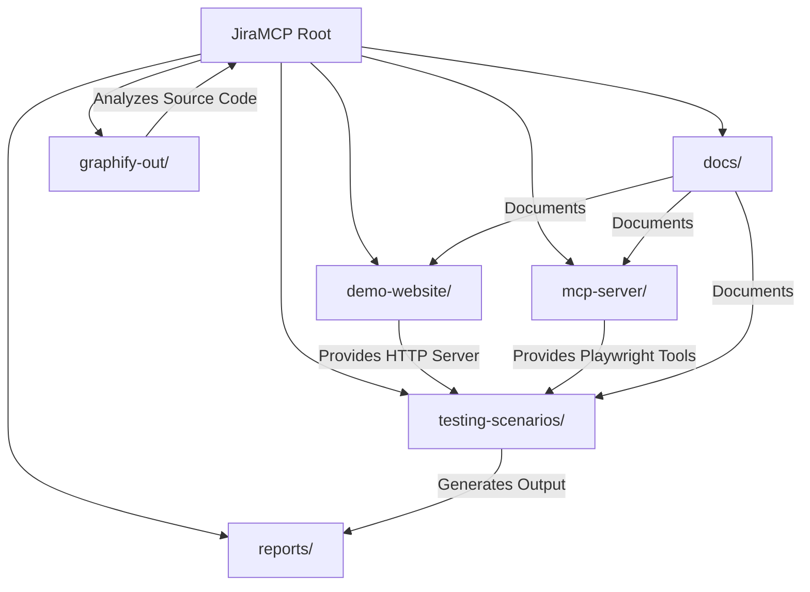

# Folder Structure & Directory Map

This document describes the complete folder layout of the repository, explaining the purpose, responsibility, and relationships of every directory and major file.

---

## 📂 Repository File Tree

```
JiraMCP/
├── pom.xml                               # Top-level Parent Maven POM
├── README.md                             # Project primary documentation & quick start
├── demo-website/                         # Standalone HTTP web server module
│   ├── pom.xml                           # Module POM configuration
│   └── src/
│       └── main/
│           ├── java/
│           │   └── com/demo/website/
│           │       ├── DemoWebServer.java
│           │       └── handlers/
│           │           ├── AboutHandler.java
│           │           ├── ContactHandler.java
│           │           ├── HomeHandler.java
│           │           ├── LinksHandler.java
│           │           ├── NavigationHelper.java
│           │           └── StaticAssetHandler.java
│           └── resources/
│               └── static/
│                   ├── style.css
│                   └── images/
│                       └── under_construction.svg
├── mcp-server/                           # Playwright MCP Server module
│   ├── pom.xml                           # Module POM (Assembly plugin config)
│   └── src/
│       └── main/
│           └── java/
│               └── com/demo/mcp/
│                   ├── json/
│                   │   ├── JsonParser.java
│                   │   └── JsonValue.java
│                   ├── protocol/
│                   │   ├── McpMessage.java
│                   │   └── McpServer.java
│                   └── tools/
│                       ├── PlaywrightManager.java
│                       └── PlaywrightToolRegistry.java
├── testing-scenarios/                    # Automated testing execution pipeline
│   ├── pom.xml                           # Module POM (Assembly plugin config)
│   └── src/
│       └── main/
│           └── java/
│               └── com/demo/testing/
│                   ├── AccessibilityTestRunner.java
│                   ├── FunctionalTestRunner.java
│                   ├── MainTestPipeline.java
│                   ├── PerformanceTestRunner.java
│                   ├── TestReportGenerator.java
│                   └── UxJourneyTestRunner.java
├── docs/                                 # Complete documentation store
│   ├── README.md                         # Documentation sitemap & index
│   ├── architecture.md                   # System design & sequence diagrams
│   ├── modules.md                        # Deep dive into modules, packages & classes
│   ├── folder-structure.md               # Folder structure & directory responsibilities
│   ├── dependency-graph.md               # Project dependencies & library graph
│   ├── runtime.md                        # Execution flows & virtual thread model
│   ├── configuration.md                  # System settings & runtime parameters
│   ├── database.md                       # Data persistence specification
│   ├── api.md                            # HTTP & MCP JSON-RPC Stdio API specification
│   ├── development.md                    # Developer setup & Maven workflow
│   ├── deployment.md                     # Packaging, assembly & process execution
│   ├── testing.md                        # Automated audit framework reference
│   ├── intentional_defects.md            # UX & WCAG intentional defect spec
│   ├── mcp_examples.md                   # MCP JSON-RPC protocol examples
│   └── glossary.md                       # Project technical terminology dictionary
├── reports/                              # Execution output reports & screenshots
│   ├── accessibility_report.md           # WCAG accessibility defect report
│   ├── functional_report.md              # Route availability & link audit report
│   ├── performance_report.md             # Page timing & resource metrics report
│   ├── ux_journey_report.md              # UX multi-step test execution log
│   └── ux_journey_screenshot.png         # Full-page proof screenshot
└── graphify-out/                         # Graphify knowledge graph outputs
    ├── graph.html                        # Interactive graph visualization
    ├── graph.json                        # Raw knowledge graph JSON
    └── GRAPH_REPORT.md                   # Codebase audit & graph summary report
```

---

## 🏛️ Directory Responsibilities & Relationships



### Breakdown of Primary Directories

| Directory | Primary Purpose | Dependencies / Relationships |
|-----------|-----------------|------------------------------|
| `demo-website/` | Implements the retro HTTP web server serving static assets and dynamic HTML handlers on port 8080. | Depends only on JDK 21 standard library. Used by `testing-scenarios`. |
| `mcp-server/` | Implements the standard input/output Model Context Protocol (MCP) server exposing Playwright tools via JSON-RPC 2.0. | Depends on `com.microsoft.playwright:playwright:1.49.0`. Used by `testing-scenarios` and external MCP clients. |
| `testing-scenarios/` | Master pipeline module executing automated functional, performance, accessibility, and UX tests. | Depends on `demo-website`, `mcp-server`, and `playwright`. |
| `docs/` | Comprehensive technical documentation written in Markdown covering architecture, APIs, workflows, and defects. | References source code across all three modules. |
| `reports/` | Output directory created at runtime to store generated Markdown test reports and PNG screenshots. | Generated by `testing-scenarios/` during test execution. |
| `graphify-out/` | Graphify output folder containing extracted code nodes, edges, community reports, and interactive HTML. | Generated by Graphify tools. |
