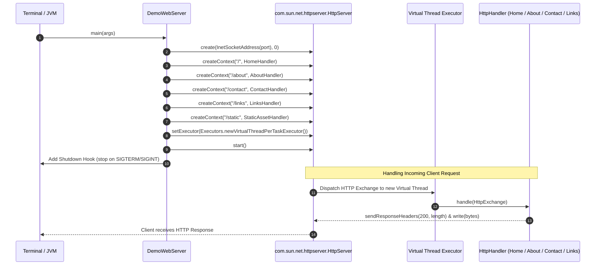
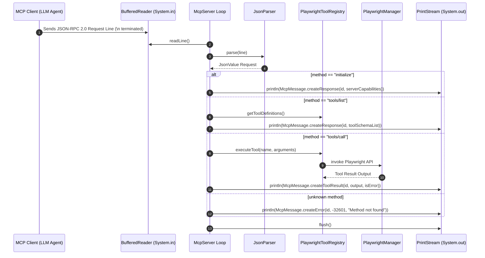

# Runtime Flow & Execution Architecture

This document describes the runtime execution flows, process lifecycles, concurrency models, and thread handling across all components of the repository.

---

## ⚡ Execution Lifecycles

The repository contains three primary executable runtime flows:

1. **Standalone HTTP Web Server (`DemoWebServer`)**
2. **Standard I/O MCP Server (`McpServer`)**
3. **Automated Test Execution Pipeline (`MainTestPipeline`)**

---

## 🌐 1. Standalone HTTP Web Server Runtime Flow

### Threading & Concurrency Model
* The web server leverages **Java 21 Virtual Threads** (`Executors.newVirtualThreadPerTaskExecutor()`).
* Each incoming HTTP connection/task spawns a lightweight virtual thread.
* Handlers are stateless and thread-safe, enabling high-throughput request handling with minimal memory footprint.

---

## 🤖 2. MCP Server Stdio Protocol Loop

### Stdio Communication Protocol Specifications
* **Input Stream:** Reads standard input (`System.in`) encoded as UTF-8, expecting newline-delimited (`\n`) JSON-RPC 2.0 requests.
* **Output Stream:** Writes JSON-RPC 2.0 response objects to standard output (`System.out`), immediately calling `writer.flush()` to prevent buffer stalls.
* **Logging Isolation:** Server operational logs are sent to `System.err` via `java.util.logging.Logger` to keep `System.out` strictly clean for JSON-RPC messages.

---

## 🧪 3. Automated Test Execution Pipeline Flow

```mermaid
flowchart TD
    Start([Start MainTestPipeline]) --> Step1[1. Instanciate & Start DemoWebServer on Port 8080]
    Step1 --> Step2[2. Launch Playwright Engine & Headless Chromium Page]
    
    Step2 --> Step3[3. Execute FunctionalTestRunner]
    subgraph Functional Audit
        Step3 --> F1[Check Route Status Codes via HttpClient]
        F1 --> F2[Scan & Validate all <a> Links]
        F2 --> F3[Evaluate <img> naturalWidth > 0]
        F3 --> F4[Submit Contact Form POST Request]
    end

    F4 --> Step4[4. Execute PerformanceTestRunner]
    subgraph Performance Audit
        Step4 --> P1[Navigate /, /about, /contact, /links]
        P1 --> P2[Evaluate performance.getEntriesByType 'navigation']
        P2 --> P3[Extract Load Time, DOM Content Loaded, FCP]
    end

    P3 --> Step5[5. Execute AccessibilityTestRunner]
    subgraph Accessibility Audit
        Step5 --> A1[Scan <img> for missing alt attributes]
        A1 --> A2[Scan <input> for missing label/aria-label]
        A2 --> A3[Check heading hierarchy jumps H1->H4]
        A3 --> A4[Identify low contrast CSS classes]
        A4 --> A5[Identify click targets < 24px]
    end

    A5 --> Step6[6. Execute UxJourneyTestRunner]
    subgraph UX Journey Audit
        Step6 --> U1[Step 1: Open Home Page]
        U1 --> U2[Step 2: Navigate to About Us]
        U2 --> U3[Step 3: Return to Home]
        U3 --> U4[Step 4: Navigate to Contact]
        U4 --> U5[Step 5: Fill Contact Form Fields]
        U5 --> U6[Step 6: Click Submit Button]
        U6 --> U7[Step 7: Capture Proof Screenshot to reports/ux_journey_screenshot.png]
    end

    U7 --> Step7[7. Invoke TestReportGenerator]
    Step7 --> R1[Write reports/functional_report.md]
    Step7 --> R2[Write reports/performance_report.md]
    Step7 --> R3[Write reports/accessibility_report.md]
    Step7 --> R4[Write reports/ux_journey_report.md]

    R4 --> Step8[8. Graceful Shutdown]
    Step8 --> S1[Close Playwright Page, Browser & Engine]
    S1 --> S2[Stop DemoWebServer]
    S2 --> End([Pipeline Completed Successfully])
```

---

## 🔒 Synchronous Safeguards & Cleanup Hooks

1. **`PlaywrightManager` Synchronization:**
   - Methods `launchBrowser(boolean headless)` and `closeBrowser()` are marked `synchronized` to ensure thread-safe browser lifecycle control.
2. **Shutdown Hooks:**
   - `DemoWebServer.main()` attaches a JVM shutdown hook (`Runtime.getRuntime().addShutdownHook(...)`) to ensure port 8080 is freed if the process receives `SIGTERM` or `SIGINT`.
3. **Pipeline `finally` Block:**
   - `MainTestPipeline` uses `try-catch-finally` to guarantee `browser.close()`, `playwright.close()`, and `server.stop()` execute even if a test throws an exception.
