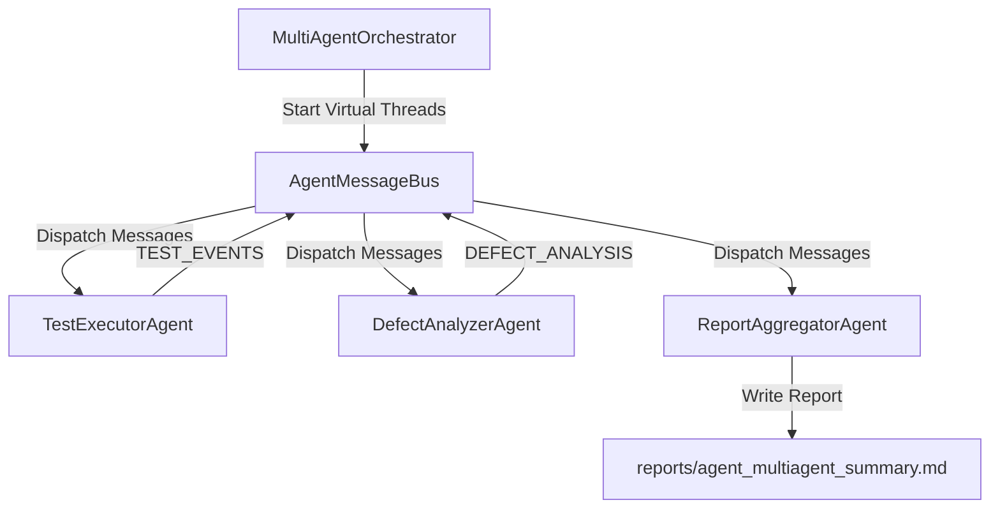

# Design Spec: Native Java Multi-Agent Orchestrator

**Date:** 2026-07-24  
**Status:** Approved  
**Author:** Software Engineering Sub-Agent  

---

## 1. Overview

The Native Java Multi-Agent Orchestrator provides an in-memory, thread-safe autonomous multi-agent system built entirely in Java 21 standard library within the `testing-scenarios` module.

---

## 2. Architecture & Design Principles

1. **Java 21 Concurrency:** Agents run on Virtual Threads (`Executors.newVirtualThreadPerTaskExecutor()`).
2. **In-Memory Message Bus:** Communication handled by `AgentMessageBus` using thread-safe channels (`ConcurrentLinkedQueue`, `ConcurrentHashMap`).
3. **Zero External Dependencies:** Uses standard Java 21 types and existing `com.demo.mcp.json.*` JSON parser.
4. **Ponytail Minimalism & Caveman Compression:** High performance, minimal boilerplate, concise reporting outputs.

---

## 3. Component Breakdown



### Classes in `com.demo.testing.agent`:
1. `AgentMessage.java`: Record `(String id, String senderId, String recipientId, String topic, JsonObject payload, Instant timestamp)`.
2. `AgentMessageBus.java`: Non-blocking pub/sub message router.
3. `BaseAgent.java`: Abstract agent lifecycle on Virtual Threads.
4. `TestExecutorAgent.java`: Executes `MainTestPipeline` and broadcasts test progress.
5. `DefectAnalyzerAgent.java`: Listens for failures, inspects surefire logs, extracts tracebacks.
6. `ReportAggregatorAgent.java`: Aggregates agent messages, writes caveman summary report.
7. `MultiAgentOrchestrator.java`: Main bootstrap entry point.

---

## 4. Execution Command

```bash
mvn exec:java -Dexec.mainClass="com.demo.testing.agent.MultiAgentOrchestrator" -pl testing-scenarios
```
