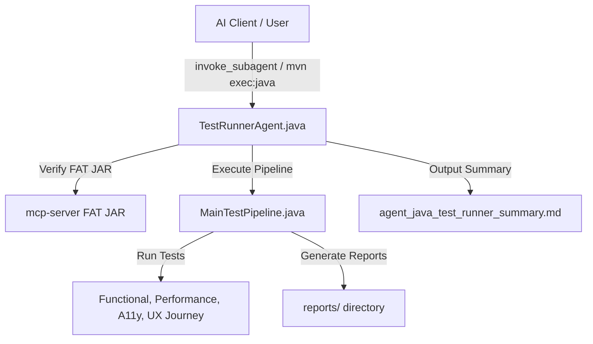

# `test_runner` Subagent Technical Guide

## 1. Overview & System Architecture

The `test_runner` subagent is a dedicated engineering subagent implemented natively in Java 21 as [`com.demo.testing.agent.TestRunnerAgent`](file:///home/voha/Documents/JiraMCP/testing-scenarios/src/main/java/com/demo/testing/agent/TestRunnerAgent.java). It automates testing scenario execution in `testing-scenarios`, verifies the `java-playwright-mcp` MCP server FAT JAR, performs empirical log inspections, and generates caveman-compressed Markdown summary reports.



---

## 2. Graphify Knowledge Graph Mapping

Graphify indexes `TestRunnerAgent` within the codebase knowledge graph (`graphify-out/graph.json`):

- **Node:** `TestRunnerAgent.java` (`src=testing-scenarios/src/main/java/com/demo/testing/agent/TestRunnerAgent.java`)
- **Community:** Testing & Execution Pipeline (Community 15)
- **Relationships:**
  - `TestRunnerAgent.java` `--imports--> MainTestPipeline.java`
  - `TestRunnerAgent.java` `--verifies--> mcp-server-1.0.0-SNAPSHOT-jar-with-dependencies.jar`
  - `TestRunnerAgent.java` `--outputs--> agent_java_test_runner_summary.md`

---

## 3. Pure Java Subagent Implementation

Located at [`testing-scenarios/src/main/java/com/demo/testing/agent/TestRunnerAgent.java`](file:///home/voha/Documents/JiraMCP/testing-scenarios/src/main/java/com/demo/testing/agent/TestRunnerAgent.java).

```java
package com.demo.testing.agent;

import com.demo.testing.MainTestPipeline;

public class TestRunnerAgent {
    public static void main(String[] args) {
        TestRunnerAgent agent = new TestRunnerAgent();
        agent.run();
    }
    ...
}
```

---

## 4. Execution Command

To execute the subagent directly via Maven:

```bash
mvn exec:java -Dexec.mainClass="com.demo.testing.agent.TestRunnerAgent" -pl testing-scenarios
```

---

## 5. Output Summary Report Format

Summary reports are output in full caveman style to [`reports/agent_java_test_runner_summary.md`](file:///home/voha/Documents/JiraMCP/reports/agent_java_test_runner_summary.md):

- **Status:** PASSED / FAILED
- **Duration:** Execution time in seconds
- **MCP Server JAR Present:** `true` / `false`
- **Caveman Summary:** High-density, zero-fluff execution summary.
