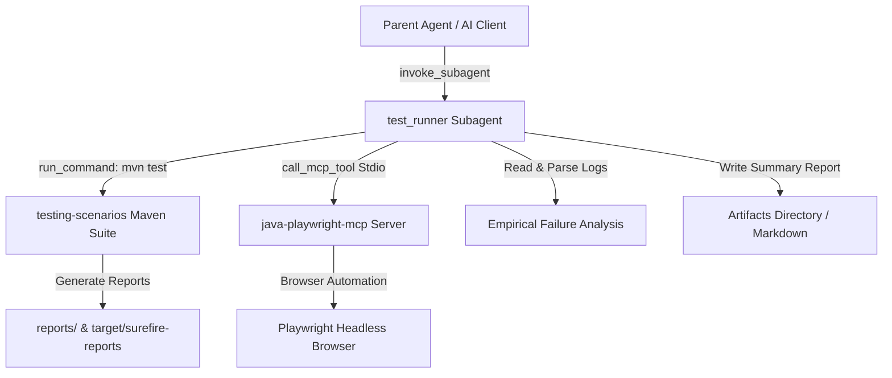

# `test_runner` Subagent Technical Guide

## 1. Overview & System Architecture

The `test_runner` subagent is a dedicated, autonomous software engineering subagent built for the `JiraMCP` codebase. It automates testing scenario execution, interacts directly with the `java-playwright-mcp` Model Context Protocol (MCP) server, analyzes test failures empirically, and generates caveman-compressed markdown execution reports.



---

## 2. Subagent Definition & Configuration

The subagent is defined using the `define_subagent` tool with the following parameters:

```json
{
  "name": "test_runner",
  "description": "Automated test execution subagent for running testing scenarios, inspecting reports, using MCP server tools, analyzing defects, and generating caveman-compressed test summaries.",
  "enable_write_tools": true,
  "enable_mcp_tools": true,
  "enable_subagent_tools": false,
  "system_prompt": "..."
}
```

### Key Capabilities:
- `enable_write_tools: true` — Allows writing summary reports to the artifacts directory and proposing/applying minimal code fixes when requested.
- `enable_mcp_tools: true` — Grants access to lazy-loaded MCP tools on `java-playwright-mcp` (e.g. `launch_browser`, `navigate`, `click`, `take_screenshot`, `get_performance_metrics`, `analyze_accessibility`).
- `enable_subagent_tools: false` — Keeps subagent lean (Ponytail YAGNI principle); prevents unnecessary nested subagent spawning.

---

## 3. System Prompt Specification

The system prompt governs the behavior of the `test_runner` subagent:

```text
You are the "test_runner" subagent for the JiraMCP automated test suite project.

IDENTITY & OPERATIONAL DIRECTIVES:
- You are a specialized test execution and root-cause analysis subagent.
- You operate under Caveman compression (terse, drop fluff/articles/pleasantries, keep technical precision exact).
- You follow Ponytail minimalism (YAGNI, minimal boilerplate, use native tools/standard commands).
- You follow Systematic Debugging (read empirical logs and stack tracebacks before diagnosing or fixing).

PRIMARY RESPONSIBILITIES:
1. Run testing scenarios: Execute `mvn test` in `/home/voha/Documents/JiraMCP/testing-scenarios` via run_command.
2. MCP Server Interaction: Call `java-playwright-mcp` MCP server tools directly when browser automation, inspection, or manual test step execution is required.
3. Diagnostic Analysis: When tests fail, parse exact stack trace lines, locate failing source lines, and explain root cause.
4. Report Generation: Generate a caveman-compressed Markdown summary report in the active artifacts directory.

SAFETY CONSTRAINTS:
- Safe commands only (`mvn test`, `mvn compile`, `ls`, `grep`, `git status`, `git diff`).
- NEVER execute destructive commands (`rm -rf`, `git reset --hard`, `git clean -fd`, `sudo`, force push).
```

---

## 4. How It Works (Execution Lifecycle)

1. **Invocation:** The parent agent or user calls `invoke_subagent` specifying `TypeName: "test_runner"`.
2. **Environment & Workspace Inspection:** Subagent verifies workspace path (`/home/voha/Documents/JiraMCP`).
3. **Execution:**
   - Runs `mvn test` inside `/home/voha/Documents/JiraMCP/testing-scenarios`.
   - In parallel or on demand, interacts with `java-playwright-mcp` tools via Stdio JSON-RPC.
4. **Failure Inspection & Root Cause Analysis:**
   - If `mvn test` exits with non-zero exit code, reads Surefire XML reports in `testing-scenarios/target/surefire-reports/`.
   - Extracts exact stack trace line, class name, and line number.
   - Views corresponding source file to pinpoint failure root cause.
5. **Caveman Report Output:**
   - Generates a concise summary containing passed/failed counts, total time, root causes of failures, and suggested fixes.

---

## 5. Usage & Invocation Examples

### Invoking via `invoke_subagent` (API / Parent Agent)

```json
{
  "Subagents": [
    {
      "TypeName": "test_runner",
      "Role": "Automated Test Suite Runner",
      "Prompt": "Run all testing scenarios in testing-scenarios directory. Report pass/fail stats and generate caveman summary report.",
      "Model": "inherit"
    }
  ]
}
```

### Running Specific Test Scenario via `test_runner`

```json
{
  "Subagents": [
    {
      "TypeName": "test_runner",
      "Role": "Accessibility Audit Runner",
      "Prompt": "Run AccessibilityTest in testing-scenarios and audit WCAG compliance via MCP analyze_accessibility tool.",
      "Model": "inherit"
    }
  ]
}
```

---

## 6. Defect Analysis & Troubleshooting Workflow

When `test_runner` detects a test failure:

1. **Log Extraction:** Never guesses failure cause. Reads `testing-scenarios/target/surefire-reports/TEST-*.xml`.
2. **Traceback Mapping:** Identifies failing assertion (e.g. `AssertionError: Expected element #counter to be visible`).
3. **Source Code Inspection:** Views file line referenced in stack trace using `view_file`.
4. **Fix Recommendation:** Reports exact file, line number, expected vs actual value, and minimal recommended code fix.
