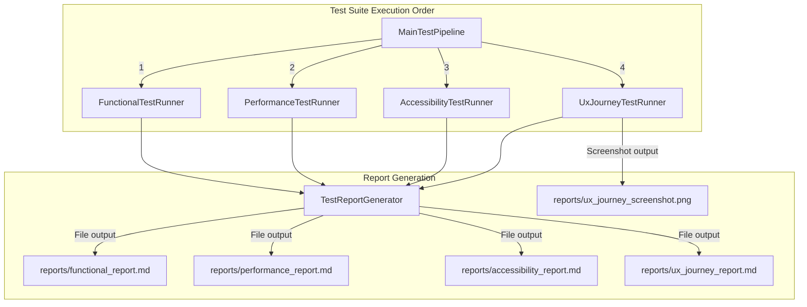

# Automated Testing Framework Specification

This document details the architectural design, test runner implementations, defect audit algorithms, and report generation mechanisms for the automated testing suite in `testing-scenarios`.

---

## 🧪 Testing Framework Architecture

The testing framework is built on top of **Microsoft Playwright Java** and **Java 21 `java.net.http.HttpClient`**. It automatically starts the embedded web server, executes four audit suites, and outputs structured Markdown and PNG proof artifacts.

---

## 📊 Test Suite Breakdown

### 1. Functional Test Suite (`FunctionalTestRunner`)

* **Target Routes:** `/`, `/about`, `/contact`, `/links`
* **Audit Checks:**
  1. **HTTP Status Code Verification:** Sends HTTP `GET` requests via `java.net.http.HttpClient` with a 3-second timeout and follows redirects. Asserts `200 OK`.
  2. **Page Navigation & Title Check:** Navigates via Playwright `Page.navigate()` and retrieves `Page.title()`.
  3. **Broken Link Audit:** Scans all `<a>` tags on every page. Sends HTTP `GET` requests to target URLs and flags links returning HTTP status `≥ 400` or connection errors.
  4. **Broken Image Audit:** Executes JavaScript snippet checking `img.complete && img.naturalWidth > 0`. Flags images that failed to render or returned HTTP `404`.
  5. **Form Submission Test:** Navigates to `/contact`, fills input fields (`username`, `email`, `comments`), submits form via `#submitBtn`, and verifies response contains `"Electronic Mail Sent!"`.

---

### 2. Performance Audit Suite (`PerformanceTestRunner`)

* **Target Routes:** `/`, `/about`, `/contact`, `/links`
* **Metrics Collected:**
  * **Load Time (`loadTimeMs`):** Difference between `loadEventEnd` and `startTime` from `performance.getEntriesByType('navigation')[0]`.
  * **DOM Content Loaded (`domContentLoadedMs`):** Difference between `domContentLoadedEventEnd` and `startTime`.
  * **First Contentful Paint (`firstContentfulPaintMs`):** `startTime` of paint entry matching `'first-contentful-paint'`.
  * **Resource Counts:** Total number of loaded sub-resources (`performance.getEntriesByType('resource').length`).

---

### 3. Accessibility Audit Suite (`AccessibilityTestRunner`)

* **Target Routes:** `/`, `/about`, `/contact`, `/links`
* **WCAG Audit Rules Executed in Browser DOM:**

| Defect Type | Severity | DOM Inspection Rule | WCAG Impact |
|-------------|----------|---------------------|-------------|
| `MISSING_ALT_TEXT` | `HIGH` | Evaluates `img` tags where `!img.hasAttribute('alt') \|\| img.alt.trim() === ''`. | Screen readers cannot describe visual imagery. |
| `MISSING_FORM_LABEL` | `HIGH` | Evaluates non-button `input`/`select`/`textarea` elements missing associated `<label for="id">` or parent `<label>`. | Form controls lack accessible names. |
| `HEADING_HIERARCHY_SKIP` | `MEDIUM` | Compares heading tags (`h1..h6`). Flags instances where `level[i+1] > level[i] + 1` (e.g. `<h1>` jump to `<h4>`). | Breaks document outline navigation for screen readers. |
| `POOR_COLOR_CONTRAST` | `HIGH` | Identifies elements with class `.low-contrast-text` (`#a0a0a0` text on `#ffffff` background). | Text fails WCAG AA minimum 4.5:1 contrast threshold. |
| `SMALL_CLICK_TARGET` | `MEDIUM` | Identifies interactive elements with class `.tiny-link` or `.tiny-submit-btn` (< 24px width/height). | Target size causes touch and mobile navigation errors. |

---

### 4. UX Journey Test Suite (`UxJourneyTestRunner`)

* **Journey Specification:** Multi-step realistic user interaction sequence:
  1. **Step 1:** Open Home Page (`/`).
  2. **Step 2:** Click About Us Link (`a[href='/about']`).
  3. **Step 3:** Return to Home Page (`a[href='/']`).
  4. **Step 4:** Click Contact Link (`a[href='/contact']`).
  5. **Step 5:** Fill Contact Form Fields (`username`, `email`, `comments`).
  6. **Step 6:** Click Submit Button (`#submitBtn`) and wait for navigation.
  7. **Step 7:** Capture Full-Page Proof Screenshot (`reports/ux_journey_screenshot.png`).
* **Latency Tracking:** Measures execution latency (in milliseconds) for each step.

---

## 📈 Generated Markdown & PNG Output Files

Report files are generated by `TestReportGenerator` and saved to `reports/`:

* **[`reports/functional_report.md`](../reports/functional_report.md):** Route status table, form submission result, broken links table, broken images table.
* **[`reports/performance_report.md`](../reports/performance_report.md):** Route performance timing matrix.
* **[`reports/accessibility_report.md`](../reports/accessibility_report.md):** Defect log containing page path, defect type, severity, and WCAG description.
* **[`reports/ux_journey_report.md`](../reports/ux_journey_report.md):** Journey summary, total duration, interaction count, step execution latency log, and embedded proof screenshot link.
* **[`reports/ux_journey_screenshot.png`](../reports/ux_journey_screenshot.png):** Visual artifact image.
